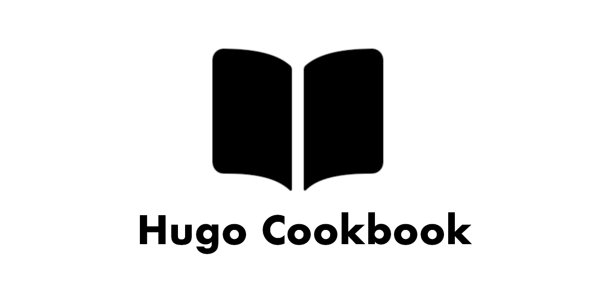

# Hugo Cookbook

Simple and minimal digital cookbook theme built for [Hugo](https://gohugo.io).

This tempalte is here to help people get started with a basic digital cookbook.  This was created due to finding old recipes that we loved, just disapear from the internet.  Due to that, I wanted to start to archive all the recipes we used.  So my personal digital cookbook, [Tombleson Family Cookbook](https://jtom38.github.io/cookbook) was created.

This template is still rough in some spots but currently in use!

This template is built with [Bulma CSS](https://bulma.io) and runs with minimal javascript.  I wanted this to work well on a tablets and phones.

## Getting Started

### Install with hugo mod

1. Install Go 1.18 or newer
   1. `go version` will help you validate if you have Go installed.
2. Run `hugo mod init github.com/username/reponame`
   1. Go uses git as its package manager so this command creates a `go.mod` file in your project and defines the project name.
   2. Replace `username` with your username
   3. Replace `reponame` with your projects name.
      1. This projects path is `github.com/jtom38/hugo-cookbok` as an example
3. Open your config file `config.yaml || config.toml` and update the theme line to show `theme: "github.com/jtom38/hugo-cookbook"`

Next time you build your project, Go/hugo will go download the repo for this theme and add it to your project at runtime!

## Features

- [x] Tags
- [x] Categories
- [x] Meta Tags
- [x] Favicon
- [x] Hugo Module Support
- [ ] Pagination
- [ ] Recipe Search
- [ ] Card Layout
- [ ] Dynamic Navbar

## Contribute

Please fork this repo and send your PR over if you have thoughts on how to improve the template!

### Local Development

If you want to do local development for your PR, you should use the hugo mod method so you can do the following steps.

1. Clone this repo
2. Open your hugo site repo
3. Open your go.mod file
4. Replace `require github.com/jtom38/hugo-cookbook` with `replace github.com/jtom38/hugo-cookbook => /Users/jamestombleson/dev/jtom38/hugo-cookbook`
   1. Change the path to your full path on your disk
5. Start up your site
6. Make changes to the cloned template repo

Note: Make sure you update your go.mod file to go back to the `require` statement when you push your code.
